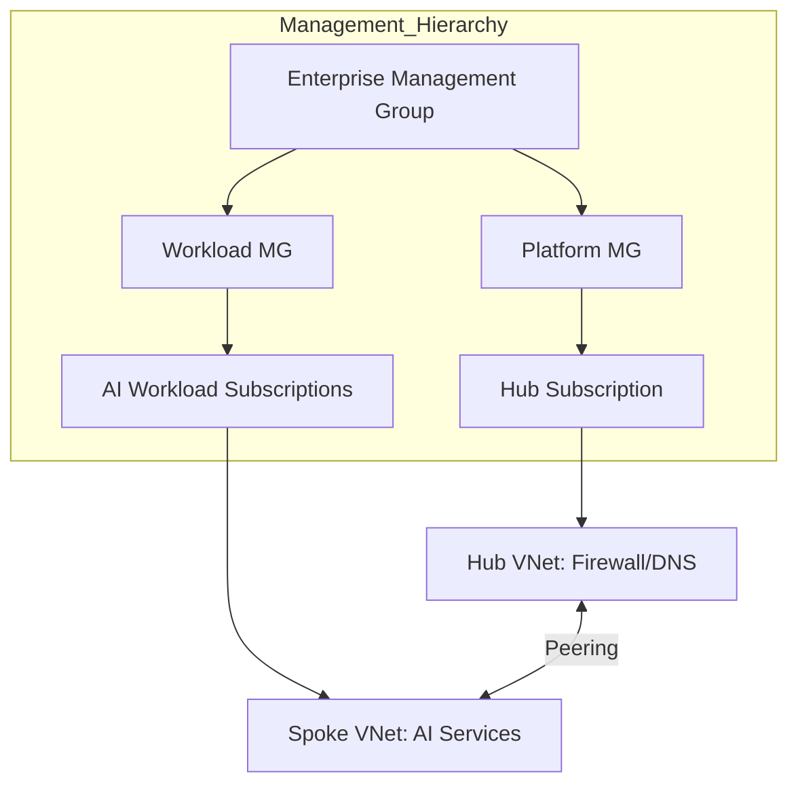
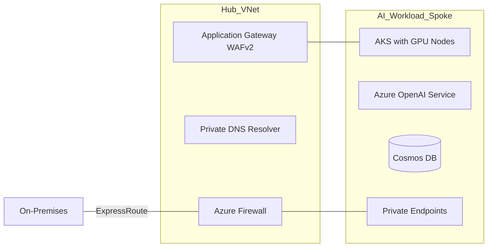
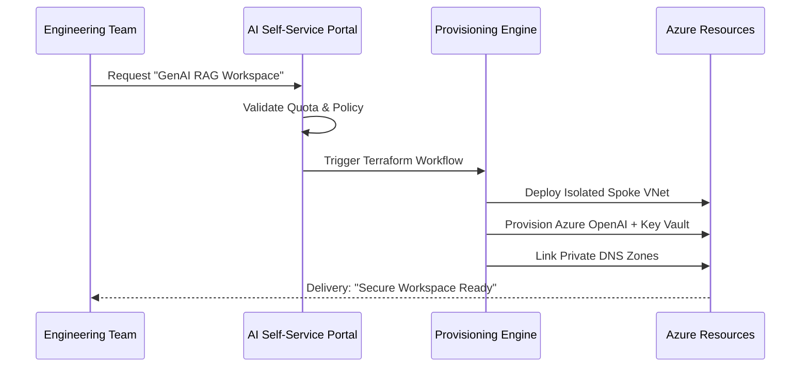
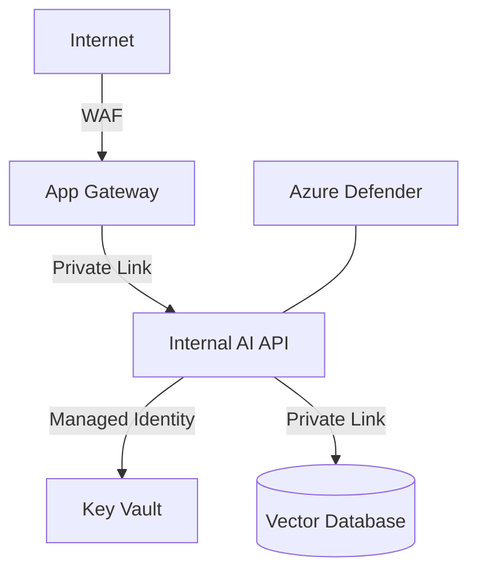



<h1>Enterprise AI Landing Zone (AI-LZ)</h1>

<strong>The Industrial Foundation for Generative AI, MLOps, and Intelligent Automation at Scale</strong>

 

> **"Scale your AI vision on a foundation of iron."** The AI Landing Zone (AI-LZ) is a production-hardened platform engineered to provide secure, governed, and self-service environments for enterprise AI workloads.

---

## 🏛️ Executive Summary

The **Enterprise AI Landing Zone (AI-LZ)** is a comprehensive deployment framework that automates the creation of high-security environments for AI, GenAI, and ML workloads. Built on **Azure Landing Zone (ALZ)** principles, it ensures that every AI project—from RAG platforms to model training—resides within a compliant, network-isolated, and governed ecosystem.

### Strategic Objectives
- **Accelerate Onboarding**: Transition from "Proposal" to "Provisioned AI Stack" in minutes.
- **Enforce Governance**: Automated Policy-as-Code to prevent public data exposure.
- **Enable FinOps**: Unit-cost visibility for GPU consumption and Token usage.
- **Scale Securely**: Standardized hub-spoke networking with regional failover.

---

## 🏗️ Technical Architecture

### 1. High-Level Blueprint

### 2. Hub-Spoke Network Topology

### 3. AI Workload Request Flow

---

## 🛡️ Governance & Security Pillars

### Policy-as-Code Automation
- **`DENY-PUBLIC-AI-ENDPOINTS`**: Prevents creation of AI services with public access.
- **`REQUIRE-VNET-INJECTION`**: Enforces all AI compute to reside within a specific subnet.
- **`ENFORCE-MD-TAGGING`**: Mandatory tagging for cost allocation by Business Unit.

### Security Baseline Diagram

---

## 📦 Global Infrastructure Stack

| Layer | Component | Technology | Priority |
|:---|:---|:---|:---:|
| **Networking** | Hub-and-Spoke | Terraform / ExpressRoute | Critical |
| **Compute** | AKS (GPU) & Container Apps | K8s / Serverless | Performance |
| **AI Services** | Azure OpenAI / AI Studio | Cognitive Services | Core |
| **Identity** | Managed Identity / Entra ID | RBAC / PIM | Security |
| **Data** | ADLS Gen2 / Cosmos DB | Private Endpoint Storage | Foundation |

---

## 🚀 Self-Service Catalog

The AI-LZ includes a **Service Catalog** allowing teams to provision standardized "T-Shirt Sized" environments:

- **Small (GenAI Sandbox)**: Single OpenAI instance + Private Endpoint + Metadata DB.
- **Medium (RAG Platform)**: AKS Cluster + Vector Search (AI Search) + Private Storage.
- **Large (MLOps Pipeline)**: Full Hub-Spoke isolation + GPU Nodes + Databricks integration.

---

## 🗺️ Multi-Year Roadmap

- **Phase 1 (Now)**: Secure Hub-Spoke foundation & Azure OpenAI automation.
- **Phase 2 (Q3 2026)**: Integration of Multi-Region DR for LLM Inference.
- **Phase 3 (2027)**: "Autonomous Infrastructure"—AI-Ops-driven scaling and healing.

---

## 🆘 Support & Scaling
Devopstrio provides dedicated **Landing Zone Operations** to support global platform engineering teams.

- **Status**: [lz-status.devopstrio.co.uk](https://devopstrio.co.uk)
- **Email**: [lz-ops@devopstrio.co.uk](mailto:lz-ops@devopstrio.co.uk)

---
&copy; 2026 Devopstrio &mdash; Mastering the Enterprise AI Foundation.
