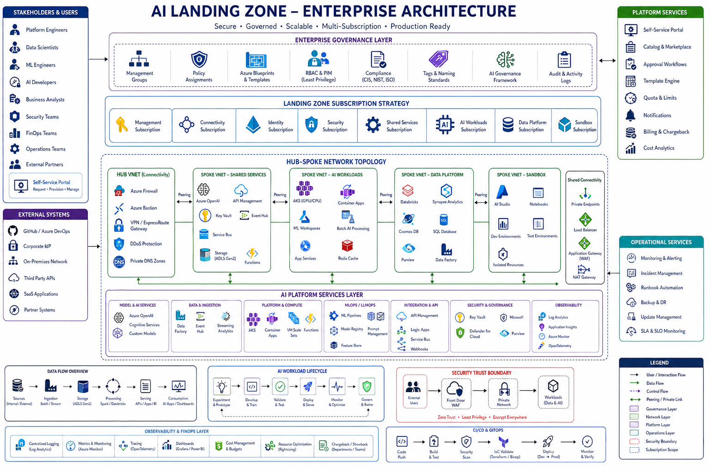
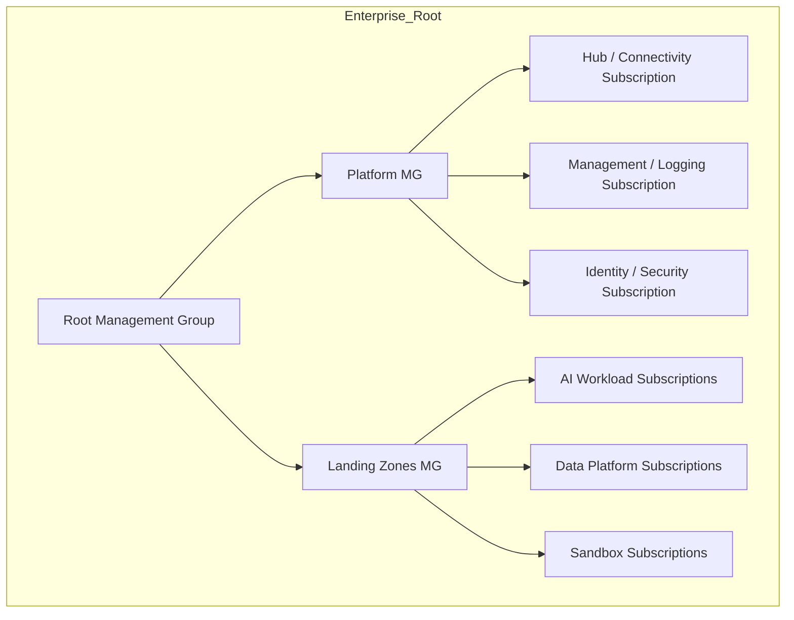
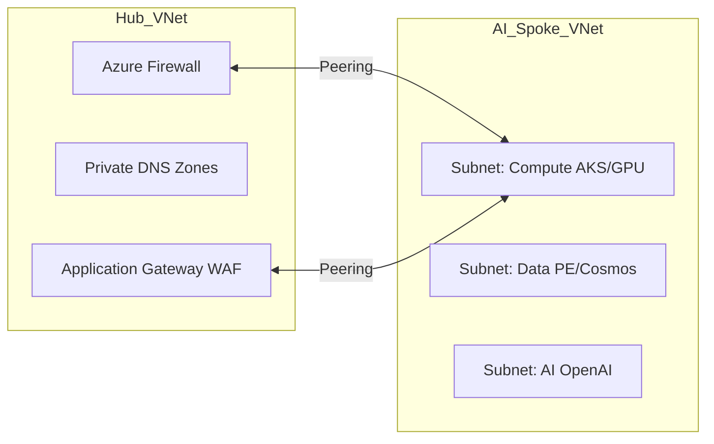
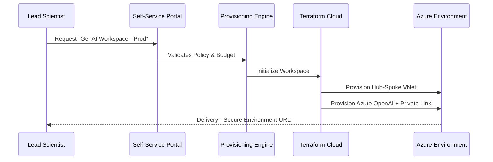

<div align="center">


<h1>AI Landing Zone (AI-LZ)</h1>

<p><strong>The Industrial Foundation for Generative AI, MLOps, and Intelligent Automation</strong></p>

[](https://devopstrio.co.uk/)
[](/terraform)
[](/terraform)
[](https://devopstrio.co.uk/)

<br/>

> **"Scale your AI vision on a foundation of iron."** The AI Landing Zone (AI-LZ) is a production-hardened platform designed to provide secure, governed, and self-service environments for enterprise AI workloads.

</div>

---

## 🏛️ High-Level Architecture (Reference)



---

## 📐 Enterprise Architecture Pillars

### 1. Management Group & Subscription Hierarchy
The AI-LZ follows the **Azure Landing Zone (ALZ)** conceptual architecture, utilizing a multi-subscription model to isolate platform services from AI workloads.



### 2. Hub-and-Spoke Networking Topology
A centralized Hub VNet manages egress via Azure Firewall, while Spoke VNets house isolated AI compute and data.



### 3. Self-Service Provisioning Workflow
Teams request resources via our **Governance Portal**, which triggers automated IaC deployments with built-in guardrails.



---

## 🏗️ Technical Specification

| Domain | Solution Component | Tech Stack |
|:---|:---|:---|
| **Networking** | Hub-Spoke / Private Link | Terraform / Azure Firewall |
| **Compute** | AKS (GPU) & Container Apps | K8s / Azure Bicep |
| **AI Core** | Azure OpenAI / AI Studio | Cognitive Services |
| **Security** | Key Vault / Bastion / WAF | Managed Identity |
| **Governance** | Azure Policy / Purview | Policy-as-Code |
| **FinOps** | Budgeting & Tagging | Azure Cost Management |

---

## �️ Security & Compliance Baseline

The platform implements a **Zero-Trust** security model including:
- **NSG/ASG Hardening**: Strictly controlling East-West and North-South traffic.
- **Vulnerability Scanning**: Automated image scanning via Microsoft Defender.
- **Secret Management**: Zero-knowledge secret handling via Key Vault.
- **DDoS Protection**: Integrated Application Gateway with WAF protection for AI APIs.

---

## � Deployment Guide

### Local Provisioning
```powershell
./scripts/provision-ailz.ps1 -Environment prod
```

### CI/CD Trigger
The platform uses **GitHub Actions** for idempotent deployments.
1.  **Plan**: Automated IaC linting and cost estimation.
2.  **Approve**: Mandatory PR approval from Cloud Governance team.
3.  **Apply**: Deterministic deployment to the target subscription.

---

## 🆘 Support & Consulting
Devopstrio provides managed transition services for organizations migrating to industrial-grade AI foundations.

- **Web**: [devopstrio.co.uk](https://devopstrio.co.uk)
- **Consulting**: [ailz-support@devopstrio.co.uk](mailto:ailz-support@devopstrio.co.uk)

---
<sub>&copy; 2026 Devopstrio &mdash; Scaling AI Engineering Excellence.</sub>
